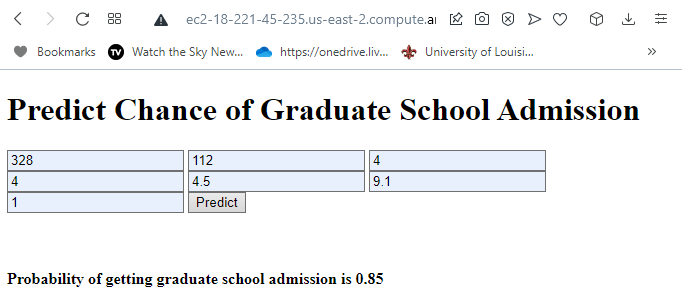

# Who-is-in
### Deploying a Flask Machine Learning Application in AWS

## Project Overview
I built a demo web page that a user can use to enter determine their chances of graduate school admission. The user inputs test scores and other metrics. The web page will then send the values off to the deployed XGBoost model, which will predict the probability of admittance. 

## Key Skills Demonstrated
* Supervised Learning
* Model deployment via AWS EC2
* APIs for web deployment
* Flask Web App

## Data
I used the Graduate Admission 2 dataset. The dataset contains several parameters which are considered important during the application for Masters Programs.
The parameters included are :

* GRE Scores ( out of 340 )
* TOEFL Scores ( out of 120 )
* University Rating ( out of 5 )
* Statement of Purpose and Letter of Recommendation Strength ( out of 5 )
* Undergraduate GPA ( out of 10 )
* Research Experience ( either 0 or 1 )
* Chance of Admit ( ranging from 0 to 1 )

> Mohan S Acharya, Asfia Armaan, Aneeta S Antony : A Comparison of Regression Models for Prediction of Graduate Admissions, IEEE International Conference on Computational Intelligence in Data Science 2019

## Project Steps

1. Download the dataset.
2. Train an XGBoost model.
3. Create the web app files
4. Create an EC2 instance
5. Upload all model artifacts to cloud server
6. Deploy the model.

## Project Output

